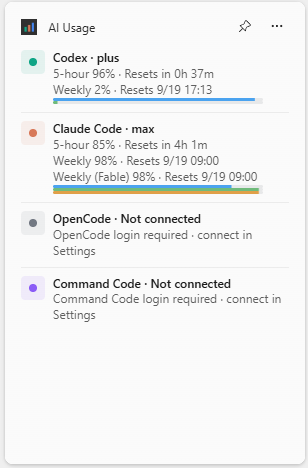
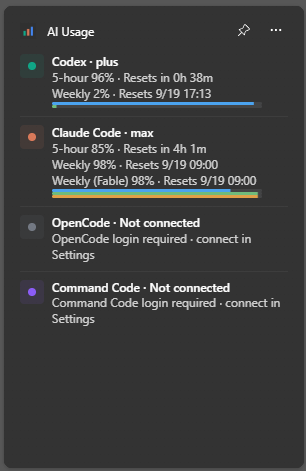

# AI Usage Widget

[English](README.md)

Windows 11 위젯 보드(Win + W)에서 **Codex**와 **Claude Code** 구독 사용량을 보여주는 위젯입니다. Windows 라이트·다크 테마를 따릅니다.

| 라이트 | 다크 |
| --- | --- |
|  |  |

- 5시간·주간 한도와 리셋 시간, 진행 막대 표시
- Claude Code는 모델별 주간 한도 한 줄 추가 표시 (기본값 Fable)
- 위젯의 **위젯 사용자 지정** 메뉴에서 서비스별 표시 토글
- 자체 로그인 화면이 없습니다. PC에 이미 설치된 Codex·Claude Code CLI의 로그인을 그대로 사용합니다.

## 필요 환경

- Windows 11 22H2 이상, x64
- [.NET 10 SDK](https://dotnet.microsoft.com/download)
- [Windows SDK](https://developer.microsoft.com/windows/downloads/windows-sdk/) (`makeappx.exe`, `makepri.exe` 포함)
- Windows Web Experience Pack (위젯 보드. 대부분의 PC에 기본 설치됨)
- **개발자 모드** 켜기: 설정 → 시스템 → 개발자용 → 개발자 모드
- Windows PowerShell 5.1 (Windows 기본 포함)
- 최초 빌드 시 인터넷 연결 (NuGet 패키지 다운로드)

아래 CLI 중 하나 이상이 설치되고 로그인되어 있어야 합니다.

- **Codex**: `npm install -g @openai/codex` 설치 후 `codex login`으로 ChatGPT 계정 로그인
- **Claude Code**: [Claude Code](https://code.claude.com/docs) 설치 후 `claude`를 한 번 실행해 로그인

## 설치

1. 저장소를 클론합니다.

   ```powershell
   git clone https://github.com/Mossworm/ai-usage-widget.git
   cd ai-usage-widget
   ```

2. 빌드하고 설치합니다. 스크립트가 빌드, 오프라인 검사, MSIX 패키징, 현재 사용자용 위젯 등록을 순서대로 실행합니다.

   ```powershell
   powershell.exe -NoProfile -ExecutionPolicy Bypass -File .\build-install.ps1
   ```

3. **Win + W**로 위젯 보드를 열고 **위젯 추가**에서 **AI Usage**를 고정합니다.

4. 표시할 서비스를 고르려면 위젯의 **⋯** 메뉴에서 **위젯 사용자 지정**을 선택합니다.

> [!IMPORTANT]
> 위젯은 저장소 안의 `artifacts/package`에서 실행됩니다. 설치 후 이 폴더나 저장소를 옮기거나 지우지 마세요.

### 업데이트

최신 변경을 받은 뒤 같은 명령을 다시 실행합니다. 설정은 유지됩니다.

```powershell
git pull
powershell.exe -NoProfile -ExecutionPolicy Bypass -File .\build-install.ps1
```

### 깨끗하게 다시 설치

현재 등록을 제거한 뒤 `build-install.ps1`을 실행합니다. `-RemoveAppData`를 붙이지 않으면 앱 데이터는 유지됩니다.

```powershell
powershell.exe -NoProfile -ExecutionPolicy Bypass -File .\uninstall-build-install.ps1
```

### 제거

```powershell
Get-AppxPackage -Name Mossworm.AIUsageWidget | Remove-AppxPackage
```

설정까지 지우려면 `%LOCALAPPDATA%\AiUsageWidget` 폴더를 삭제하세요.

### 빌드 옵션

| 옵션 | 동작 |
| --- | --- |
| `-BuildOnly` | 설치 없이 빌드·검사·패키징만 실행. 개발자 모드 불필요 |
| `-Msix` | `-BuildOnly`와 동일 |
| `-Configuration Debug` | Release 대신 Debug로 빌드 |

MSIX는 `artifacts/msix/`에 생성되고 `artifacts/AiUsageWidget.msix`로도 복사됩니다. 서명되지 않은 패키지라 다른 PC에서 더블클릭으로 설치할 수 없습니다. 각 PC에서 `build-install.ps1`을 실행하세요.

## 사용량을 가져오는 방식

**Codex.** 로컬 `codex app-server`를 실행해 계정 정보와 사용 한도만 요청합니다. 프롬프트를 실행하거나 모델을 호출하지 않으며 `auth.json`을 읽지 않습니다. `codex.exe`가 여러 개 설치되어 있으면 가장 최근에 갱신된 것을 씁니다. 특정 파일을 쓰려면 `CODEX_EXECUTABLE`에 전체 경로를 지정하세요.

**Claude Code.** `%USERPROFILE%\.claude\.credentials.json`(또는 `CLAUDE_CONFIG_DIR`)에서 액세스 토큰을 읽어 `https://api.anthropic.com/api/oauth/usage`에 요청합니다. 파일은 읽기만 하고 토큰을 갱신하지 않으므로 Claude Code 로그인이 풀리지 않습니다. 토큰이 만료되면 위젯이 Claude Code를 열라고 안내하며, Claude Code를 실행하면 토큰이 갱신됩니다.

> [!WARNING]
> `/api/oauth/usage`는 Anthropic의 공개 API가 아니라 Claude Code가 쓰는 비공개 경로입니다. 언제든 바뀌거나 동작하지 않을 수 있습니다.

사용량 수치는 메모리에만 보관합니다. 분석·원격 측정·개발자 서버는 없습니다. [개인정보 처리방침](docs/privacy-policy.md)을 참고하세요.

### 환경 변수

| 변수 | 기본값 | 용도 |
| --- | --- | --- |
| `CODEX_EXECUTABLE` | (자동 탐색) | 사용할 `codex.exe`의 전체 경로 |
| `CLAUDE_CONFIG_DIR` | `%USERPROFILE%\.claude` | Claude Code 설정 폴더 |
| `AIUSAGE_CLAUDE_MODEL_WINDOWS` | `fable` | 표시할 모델별 주간 한도, 쉼표로 구분(`fable,opus`). 빈 값이면 표시 안 함 |
| `AIUSAGE_CLAUDE_USER_AGENT` | `claude-code/0.2.29` | Claude 사용량 요청에 보내는 User-Agent |

## 문제 해결

- **로그인 또는 만료 안내가 나올 때.** `codex login`을 실행하거나 Claude Code를 한 번 여세요.
- **위젯 추가 목록에 AI Usage가 없을 때.** 개발자 모드가 켜져 있는지, `build-install.ps1`이 오류 없이 끝났는지 확인한 뒤 위젯 보드를 닫았다 다시 여세요.
- **위젯 사용자 지정을 눌러도 설정 화면이 안 나올 때.** `uninstall-build-install.ps1`로 다시 설치하세요.
- **위젯 밖에서 연결 확인.** 아래 명령은 사용량 수치와 리셋 시간만 출력합니다.

  ```powershell
  dotnet run --project tests/AiUsage.Checks -- --live
  dotnet run --project tests/AiUsage.Checks -- --live-claude
  ```

## 데스크톱 미리보기

`artifacts/package/Desktop/AiUsage.Desktop.exe`는 같은 내용을 일반 창으로 보여줍니다. `--sample`을 붙이면 로그인 없이 고정된 샘플 데이터를 표시합니다.

## 참고

- [위젯 공급자 구현 (Microsoft)](https://learn.microsoft.com/en-us/windows/apps/develop/widgets/implement-widget-provider-cs)
- [Codex App Server](https://learn.chatgpt.com/docs/app-server)
- Codex RPC 방식은 [spourdei/codex-usage-widget](https://github.com/spourdei/codex-usage-widget)과 [ZeroP27/codex-usage](https://github.com/ZeroP27/codex-usage)를 참고했습니다.
